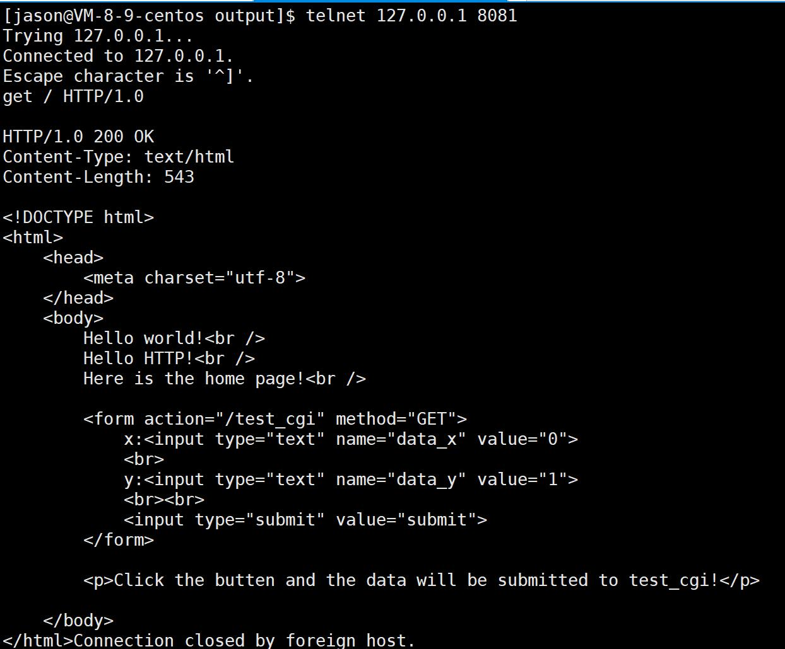
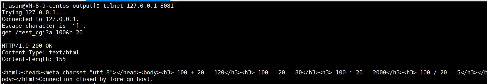
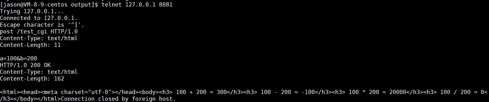
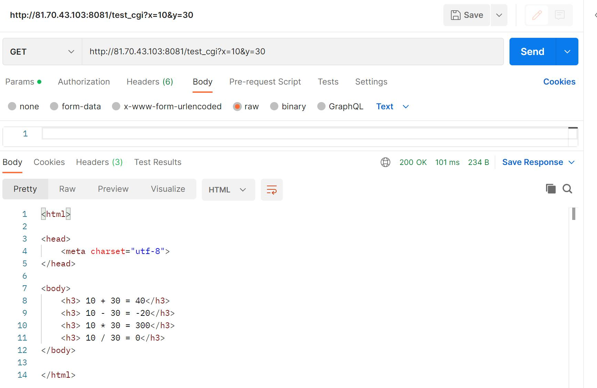
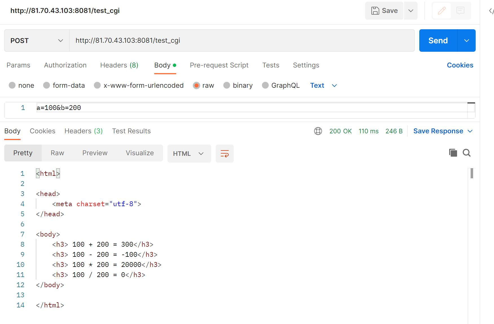

# Project_HTTP

**一个HTTP服务器的简单实现**

`./make.sh`运行，生成output目录，进入output目录`./server`即可运行

## 结果展示

#### 1.浏览器测试

* 直接输入IP和端口号，浏览器默认加上/，进入首页

  

  首页有一些文本，以及一个表单
  输入100和50，点击submit，之后进入test_cgi可执行程序进行处理，返回如下结果

  

* 如果输入100和0

  

  直接发生除0错误，返回400

  

* 访问在根目录下的a目录，即/a

  

  依然可以显示首页，并且可以进行正常输入和运行

  

* 访问一个不存在的网页，返回404

  

#### 2.telnet测试

可以看到，get和post方法都可以正确发送请求和响应

#### 3.Postman测试

* GET方法

  

* POST方法

  
